# SHREYAS K N

**Cloud · Agentic Systems · Full Stack**

Building cloud-native AI products, resilient backend systems, and agentic workflows.

## Stack

**Languages**

**Backend & Data**

**AI & Systems**

**Cloud & Infra**

**Frontend**

**Core CS**

## Projects

| Project | Description | Repository | Live Demo |
| --- | --- | --- | --- |
| **Lurien Matrix** | Transparent middleware proxy intercepting prompts through 6 sequential security layers with sub-150ms latency. |  |  |
| **Alethia** | Self-healing CI/CD agent integrated as a GitHub App that diagnoses test failures and validates automated containerized fixes. |  |  |
| **Lucy** | Voice-controlled AI accessibility assistant enabling hands-free web navigation and browser task automation. |  |  |
| **Valerie** | Automated red-teaming multi-agent platform evaluating LLM applications against 15+ adversarial attack vectors. |  |  |

## Stats

## Currently Exploring

- Multi-Agent Orchestration & Autonomous Systems
- LLM Security Proxies & Adversarial Robustness
- Cloud-Native Infrastructure & IaC
- High-Performance Distributed Systems
- Open Source Tooling

## Contact

- **Portfolio:** 

- **GitHub:** 

- **LinkedIn:** 

- **Email:** 
